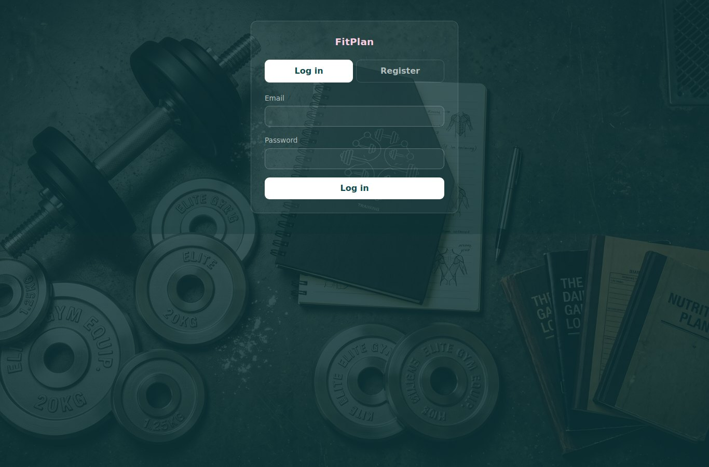
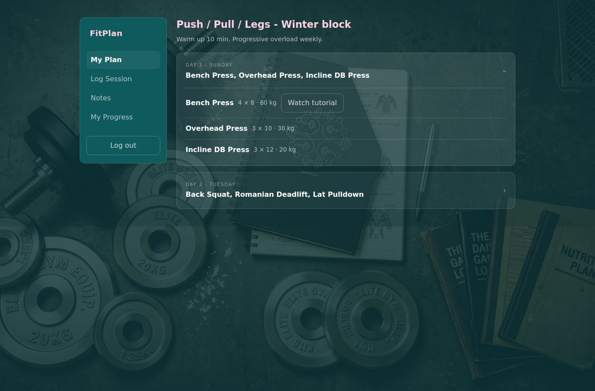
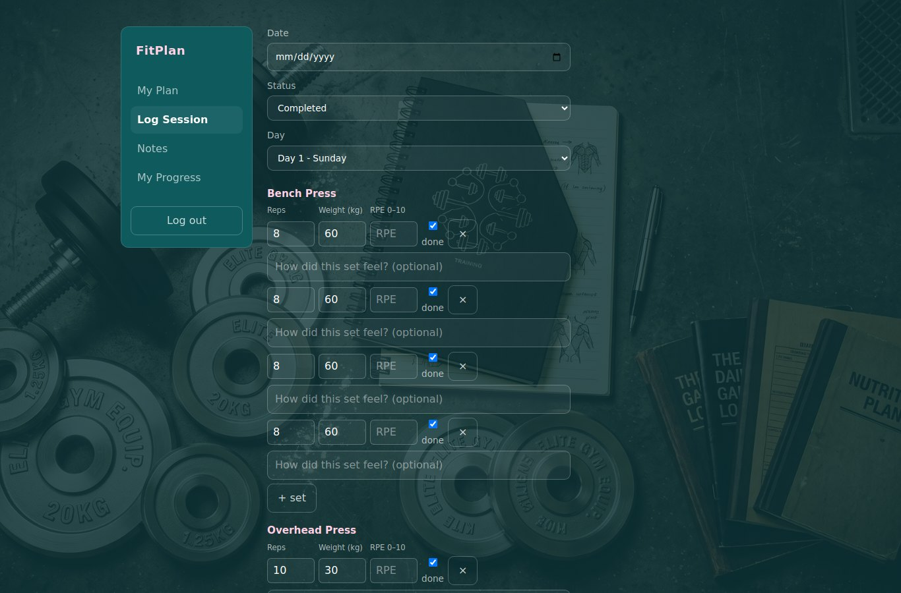
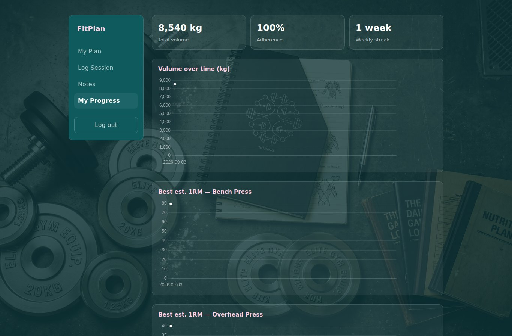
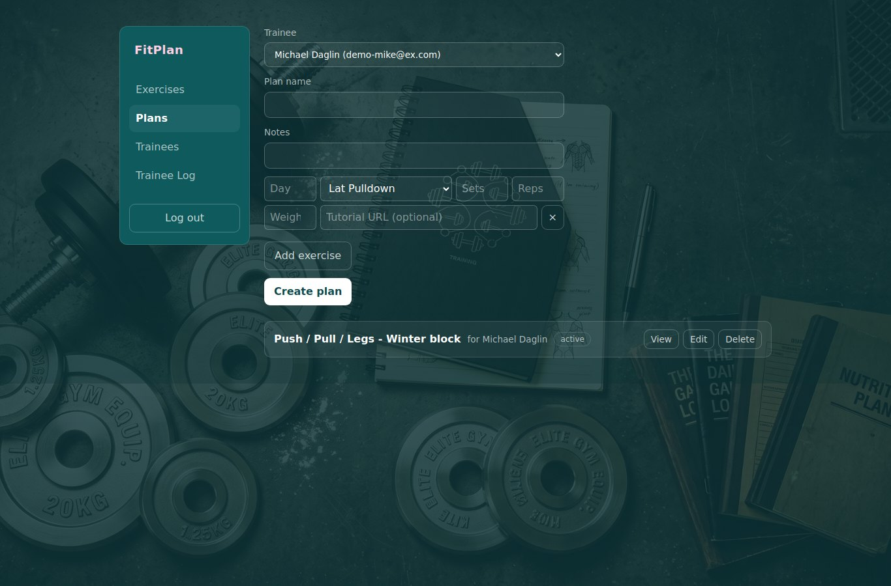
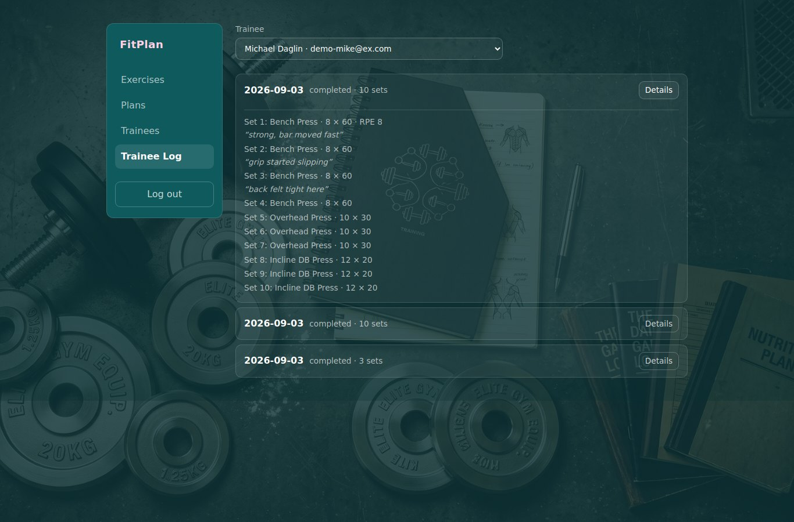

# FitPlan

[](https://github.com/inbarayasoo/FitPlan/actions/workflows/ci.yml)

A workout-tracking REST API with a **coach** side and a **trainee** side, in C++20.
Coaches build an exercise library and workout plans, assign them to trainees, and
track progress. Trainees follow the plan, log their sessions, keep private
per-exercise notes, and see their records and trends (e1RM, volume, adherence,
weekly streak).

One process, one SQLite file, no external services. A small vanilla-JS frontend
is served by the same server.

## Screenshots

<table>
  <tr>
    <td></td>
    <td></td>
  </tr>
  <tr>
    <td></td>
    <td></td>
  </tr>
  <tr>
    <td></td>
    <td></td>
  </tr>
</table>

## Run

```bash
docker compose up --build
```

- App: <http://localhost:8080>
- API docs (Swagger UI): <http://localhost:8080/docs>

For a non-default signing key, put `FITPLAN_JWT_SECRET=...` in a local `.env` file
first. Data persists in the `fitplan-data` volume (`docker compose down -v` wipes it).

**Sign in with Google** (optional): add `FITPLAN_GOOGLE_CLIENT_ID=<OAuth 2.0 web
client id>` to `.env`, with `http://localhost:8080` registered as an authorized
JavaScript origin in Google Cloud. Unset, the feature stays off and the button is
hidden; email + password always works.

**Email verification**: every email + password sign-up must confirm its address
with a six-digit code before it can log in. Set `FITPLAN_BREVO_API_KEY` (and
`FITPLAN_EMAIL_FROM`, a verified [Brevo](https://www.brevo.com) sender) in `.env`
to actually send the code; without a key the code is written to the server log so
local runs still work. Google accounts are pre-verified. The seeded demo accounts
below are seeded already verified.

## Build from source

WSL2 / Ubuntu 24.04:

```bash
sudo apt install -y build-essential g++-13 cmake ninja-build git pkg-config \
    libssl-dev libsodium-dev libsqlite3-dev libasio-dev libcurl4-openssl-dev

cmake --preset dev && cmake --build --preset dev
./build/dev/fitplan            # http://localhost:8080
ctest --preset dev             # unit + integration tests
./build/dev/fitplan --seed     # load demo data (run from the repo root)
```

Demo logins after `--seed`:

| Role    | Email                 | Password            |
| ------- | --------------------- | ------------------- |
| Coach   | `coach@fitplan.dev`   | `coach-demo-pass`   |
| Trainee | `trainee@fitplan.dev` | `trainee-demo-pass` |

## Stack

C++20 &middot; CMake + Ninja &middot; [Crow](https://github.com/CrowCpp/Crow) HTTP
&middot; SQLite via [SQLiteCpp](https://github.com/SRombauts/SQLiteCpp) &middot;
JWT HS256 ([jwt-cpp](https://github.com/Thalhammer/jwt-cpp)) + Argon2id
([libsodium](https://doc.libsodium.org/)) &middot;
[nlohmann/json](https://github.com/nlohmann/json) &middot;
[spdlog](https://github.com/gabime/spdlog) &middot; GoogleTest &middot;
OpenAPI 3 + Swagger UI &middot; Docker &middot; GitHub Actions &middot; Google
Sign-In / OIDC ([cpr](https://github.com/libcpr/cpr) for Google's JWKS, RS256
verification via jwt-cpp) &middot; transactional email for verification codes
(Brevo API over cpr).

## Architecture

Layered and one-way: `Middleware -> Controller -> Service -> Repository -> SQLite`.
The service layer is framework-free, so business logic is unit-tested without
starting a server. Every error response is uniform `application/problem+json`.

Configuration is via `FITPLAN_*` environment variables with development-safe
defaults; the full list is in [`src/config/Config.hpp`](src/config/Config.hpp).

## License

MIT - see [LICENSE](LICENSE).
